# Fabric RAG Application - Architecture Diagram (Mermaid TD)

## 🏗️ System Architecture Overview

### **High-Level Architecture**

```mermaid
graph TD
    %% User Interface Layer
    subgraph UI["User Interface Layer"]
        ST[Streamlit UI<br/>• Question Input<br/>• Results Display<br/>• Code Execution]
        SE[SQL Editor<br/>• Query Builder<br/>• Syntax Check<br/>• Results Grid]
        DP[Data Preview<br/>• Table Display<br/>• Schema View<br/>• Data Stats]
        SB[Status Bar<br/>• Progress<br/>• Step Status<br/>• Error Info]
    end

    %% Application Logic Layer
    subgraph AL["Application Logic Layer"]
        RP[RAG Pipeline<br/>• Hybrid Search<br/>• Context Gen<br/>• Code Gen<br/>• Error Handle]
        FV[FAISS Vector<br/>Search Engine<br/>• Index Mgmt<br/>• Similarity<br/>• Memory Opt<br/>• GPU Support]
        IT[Intelligent<br/>Table Selection<br/>• Keyword Match<br/>• Auto-Fetch<br/>• Performance<br/>• User Control]
        DH[Data Type<br/>Handler<br/>• Type Detect<br/>• Safe Ops<br/>• Conversion<br/>• Validation]
    end

    %% Data Access Layer
    subgraph DA["Data Access Layer"]
        MF[Microsoft Fabric<br/>GraphQL API<br/>• Data Fetch<br/>• Schema Query<br/>• Batch Process]
        AA[Azure AD<br/>Authentication<br/>• Token Mgmt<br/>• Permissions<br/>• Security]
        OA[OpenAI API<br/>• GPT-3.5-turbo<br/>• Code Gen<br/>• Reasoning<br/>• Context]
        LC[Local Cache<br/>• Embeddings<br/>• Results<br/>• Metadata<br/>• TTL Mgmt]
    end

    %% Connections
    ST --> RP
    SE --> MF
    DP --> MF
    SB --> RP
    SB --> FV
    SB --> IT

    RP --> FV
    RP --> OA
    RP --> DH
    IT --> MF
    DH --> MF

    FV --> LC
    MF --> AA
    OA --> LC
```

## 🔄 Data Flow Architecture

### **Primary Data Flow**

```mermaid
graph TD
    UQ[User Question] --> UI[Streamlit UI<br/>Input Handler]
    UI --> ITS[Intelligent<br/>Table Selection<br/>• Keyword Match<br/>• Auto-Fetch]
    ITS --> MF[Microsoft Fabric<br/>GraphQL API<br/>• Data Fetch<br/>• Schema Query]
    MF --> FV[FAISS Vector<br/>Search Engine<br/>• Embedding Gen<br/>• Similarity<br/>• Top-N Results]
    FV --> OA[OpenAI API<br/>• Context Prep<br/>• Reasoning Gen<br/>• Code Gen]
    OA --> SCE[Safe Code<br/>Execution<br/>• Validation<br/>• Error Handle<br/>• Results]
    SCE --> RD[Results Display<br/>• Visualizations<br/>• Insights<br/>• Code Output]
```

## 🧠 Component Interaction Diagram

### **RAG Pipeline Components**

```mermaid
graph TD
    UI[User Input] --> QP[Question Parser]
    QP --> KE[Keyword Extractor]
    KE --> TS[Table Selector<br/>• Auto-Detect<br/>• Manual Override<br/>• Performance]
    
    QP --> EG[Embedding Gen<br/>• OpenAI API<br/>• Local Model<br/>• Vector Store]
    KE --> CB[Context Builder<br/>• Schema Info<br/>• Sample Data<br/>• Query Context]
    
    TS --> DF[Data Fetcher<br/>• GraphQL API<br/>• Batch Process<br/>• Cache Mgmt]
    EG --> FS[FAISS Search<br/>• Index Query<br/>• Similarity<br/>• Top-N Results]
    CB --> LP[LLM Processor<br/>• Reasoning Gen<br/>• Code Gen<br/>• Error Handle]
    
    DF --> DP[Data Processor<br/>• Type Handler<br/>• Validation<br/>• Conversion]
    FS --> RR[Result Ranker<br/>• Relevance<br/>• Confidence<br/>• Diversity]
    LP --> CE[Code Executor<br/>• Safe Exec<br/>• Error Catch<br/>• Output Format]
    
    DP --> RA[Results Aggregator<br/>• Combine Results<br/>• Format Output<br/>• Generate Insights<br/>• Error Report]
    RR --> RA
    CE --> RA
```

## 🧑‍🔬 Fine-Tuning & Domain Adaptation Architecture

- Q&A/code pairs are exported from the SQL Editor as CSV.
- Fine-tuning is performed using the utility script and local CSV files (no direct SQL access).
- Dependencies: accelerate, datasets (see requirements.txt).

## 🚀 What's New in v2.1
- Model, table, and date selection are now in the main RAG QA tab (not the sidebar).
- Data preview and RAG QA support pagination for large tables.
- Data fetching and preview steps show progress bars.
- Automatic sampling is used for large datasets to improve performance.
- LLM context always includes unique values for categorical columns and guidance for substring/case-insensitive filtering.
- See TROUBLESHOOTING.md for new error handling and performance tips.

## 🐛 Troubleshooting
See TROUBLESHOOTING.md for a list of known issues, ODBC/pyodbc driver troubleshooting, and solutions for common errors.

## 🔐 Security Architecture

### **Authentication and Authorization Flow**

```mermaid
graph TD
    US[User Session] --> AAD[Azure AD Auth<br/>• Interactive<br/>• Browser Login<br/>• Token Mgmt]
    AAD --> TV[Token Validator<br/>• Expiry Check<br/>• Scope Verify<br/>• Refresh Logic]
    TV --> FA[Fabric Access<br/>• GraphQL Auth<br/>• SQL Auth<br/>• Permission]
    FA --> ARL[API Rate Limit<br/>• OpenAI Quota<br/>• Fabric Limits<br/>• Backoff Logic]
```

## 💾 Data Storage Architecture

### **Caching and Storage Strategy**

```mermaid
graph TD
    subgraph Storage["Storage Architecture"]
        MC[Memory Cache<br/>• Session Data<br/>• User State<br/>• Temp Results<br/>• TTL: 1 hour]
        DC[Disk Cache<br/>• Embeddings<br/>• Query Results<br/>• Metadata<br/>• TTL: 24 hours]
        VS[Vector Store<br/>• FAISS Index<br/>• Similarity<br/>• Search Cache<br/>• Persistent]
    end

    subgraph Management["Management Layer"]
        CM[Cache Manager<br/>• LRU Policy<br/>• Eviction<br/>• Monitoring]
        SA[Storage API<br/>• File System<br/>• Compression<br/>• Backup]
        IM[Index Manager<br/>• Build Index<br/>• Update Index<br/>• Optimize]
    end

    subgraph Lifecycle["Data Lifecycle Manager"]
        DLM[Data Lifecycle Manager<br/>• Cache Invalidation<br/>• Storage Cleanup<br/>• Index Maintenance<br/>• Backup]
    end

    MC --> CM
    DC --> SA
    VS --> IM
    CM --> DLM
    SA --> DLM
    IM --> DLM
```

## ⚡ Performance Architecture

### **Scalability and Optimization**

```mermaid
graph TD
    subgraph Performance["Performance Architecture"]
        LB[Load Balancer<br/>• Request Dist<br/>• Health Check<br/>• Failover]
        CL[Cache Layer<br/>• Redis/Memory<br/>• TTL Mgmt<br/>• Hit Ratio]
        BP[Batch Process<br/>• Chunk Process<br/>• Parallel Exec<br/>• Memory Opt]
    end

    subgraph Execution["Execution Layer"]
        WP[Worker Pool<br/>• Thread Pool<br/>• Process Pool<br/>• Auto Scale]
        AQ[Async Queue<br/>• Task Queue<br/>• Priority<br/>• Retry Logic]
        RM[Resource Mgmt<br/>• Memory Limit<br/>• CPU Monitor<br/>• GC Control]
    end

    subgraph Monitoring["Monitoring Layer"]
        M[Monitoring<br/>• Metrics Coll<br/>• Alert System<br/>• Performance]
        O[Optimization<br/>• Query Opt<br/>• Index Opt<br/>• Cache Opt]
        AS[Auto Scaling<br/>• Load Based<br/>• Resource Based<br/>• Demand Based]
    end

    LB --> WP
    CL --> AQ
    BP --> RM
    WP --> M
    AQ --> O
    RM --> AS
```

## 🔧 Configuration Architecture

### **Environment and Settings Management**

```mermaid
graph TD
    subgraph Config["Configuration Architecture"]
        EV[Environment Variables<br/>• API Keys<br/>• Endpoints<br/>• Credentials]
        FF[Feature Flags<br/>• Auto-Fetch<br/>• FAISS Enable<br/>• Debug Mode]
        US[User Settings<br/>• Batch Size<br/>• Date Range<br/>• Table Select]
    end

    subgraph Processing["Processing Layer"]
        CL[Config Loader<br/>• .env File<br/>• Env Vars<br/>• Secrets Mgmt]
        V[Validator<br/>• Type Check<br/>• Required<br/>• Format]
        D[Defaults<br/>• Fallback<br/>• Sensible<br/>• User Friendly]
    end

    subgraph Management["Configuration Manager"]
        CM[Configuration Manager<br/>• Hot Reload<br/>• Validation<br/>• Defaults<br/>• Environment Specific]
    end

    EV --> CL
    FF --> V
    US --> D
    CL --> CM
    V --> CM
    D --> CM
```

---

**Version**: 2.0.0  
**Last Updated**: 8th July 2025  
**Status**: Production Ready 