# Fabric RAG Application - Process Flow Diagram (Mermaid TD)

## 🔄 Detailed Process Flow Overview

### **Main Application Flow**

```mermaid
graph TD
    AS[Application Startup<br/>1. Load Environment Variables<br/>2. Initialize Streamlit Session State<br/>3. Setup Authentication Azure AD<br/>4. Initialize Caching System<br/>5. Load Configuration Settings]
    
    AS --> SC[Sidebar Configuration<br/>• Data Source Selection<br/>• Batch Size Configuration<br/>• Date Range Filter]
    
    SC --> NS[Navigation Selection<br/>• Data Preview<br/>• SQL Editor<br/>• RAG Analysis]
    
    NS --> DP{Decision Point:<br/>Navigation Selected?}
    
    DP -->|Data Preview| PF[Preview Flow]
    DP -->|SQL Editor| SEF[SQL Editor Flow]
    DP -->|RAG Analysis| RPF[RAG Pipeline Flow]
```



## 📊 Data Preview Flow

```mermaid
graph TD
    PF[Preview Flow Start] --> CTS{Check if tables<br/>are selected?}
    
    CTS -->|NO| MSG[Show message:<br/>"Please select tables to preview"]
    MSG --> RT[Return to sidebar]
    
    CTS -->|YES| DF[Fetch data from<br/>Microsoft Fabric GraphQL API]
    
    DF --> SUCCESS{Success?}
    SUCCESS -->|YES| STORE[Store data in<br/>session state]
    SUCCESS -->|NO| ERROR[Show error message<br/>and retry option]
    
    STORE --> DISPLAY[Display data preview<br/>• Show table selection<br/>• Display schema information<br/>• Show data statistics<br/>• Display sample data]
    
    DISPLAY --> UI[User interactions<br/>• Change table selection<br/>• Adjust batch size<br/>• Apply date filters<br/>• Export data]
```

## 🔍 SQL Editor Flow

```mermaid
graph TD
    SEF[SQL Editor Flow Start] --> INIT[Initialize SQL Editor<br/>• Load connection settings<br/>• Setup ODBC driver selection<br/>• Initialize query history]
    
    INIT --> UQ[User enters SQL query]
    
    UQ --> VS[Validate SQL syntax]
    VS --> VALID{Valid?}
    VALID -->|NO| SE[Show syntax error<br/>and highlight issues]
    VALID -->|YES| DS[Check for dangerous operations<br/>DROP, DELETE, etc.]
    
    DS --> SAFE{Safe?}
    SAFE -->|NO| WARN[Show warning and<br/>require confirmation]
    SAFE -->|YES| EXEC[Execute SQL query]
    
    EXEC --> CONN[Connect to Fabric SQL endpoint]
    CONN --> CONN_SUCCESS{Success?}
    CONN_SUCCESS -->|NO| CONN_ERROR[Show connection error<br/>and retry options]
    CONN_SUCCESS -->|YES| QUERY[Execute query]
    
    QUERY --> QUERY_SUCCESS{Success?}
    QUERY_SUCCESS -->|NO| QUERY_ERROR[Show execution error<br/>and suggestions]
    QUERY_SUCCESS -->|YES| HANDLE[Handle large result sets]
    
    HANDLE --> SIZE{Result size?}
    SIZE -->|SMALL| FULL[Display full results]
    SIZE -->|LARGE| PAG[Show pagination<br/>and download options]
    
    FULL --> DISPLAY_RES[Display results<br/>• Show result count<br/>• Display data grid<br/>• Show execution time<br/>• Provide export options]
    PAG --> DISPLAY_RES
```



## 🤖 RAG Analysis Flow

```mermaid
graph TD
    RPF[RAG Analysis Flow Start] --> UQ[User enters question]
    
    UQ --> VF[Validate question format]
    VF --> FORMAT{Valid format?}
    FORMAT -->|NO| FG[Show format guidance]
    FORMAT -->|YES| QL[Check question length]
    
    QL --> LENGTH{Acceptable length?}
    LENGTH -->|NO| BL[Suggest breaking into<br/>smaller questions]
    LENGTH -->|YES| ITS[Intelligent table selection<br/>• Analyze question keywords<br/>• Match keywords to available tables<br/>• Auto-select relevant tables<br/>• Allow manual override]
    
    ITS --> SB1[Status bar: Step 1<br/>"Embedding user question"]
    SB1 --> QE[Generate question embedding<br/>using OpenAI API]
    
    QE --> EMB_SUCCESS{Success?}
    EMB_SUCCESS -->|NO| EMB_ERROR[Show embedding error<br/>and retry options]
    EMB_SUCCESS -->|YES| SB2[Status bar: Step 2<br/>"Connecting to Fabric SQL endpoint"]
    
    SB2 --> CONN[Establish connection<br/>to Fabric SQL]
    CONN --> CONN_SUCCESS{Success?}
    CONN_SUCCESS -->|NO| CONN_ERROR[Show connection error<br/>and authentication issues]
    CONN_SUCCESS -->|YES| SB3[Status bar: Step 3<br/>"Running semantic vector search"]
    
    SB3 --> FE[Fetch embeddings<br/>from database]
    FE --> FE_SUCCESS{Success?}
    FE_SUCCESS -->|NO| FE_ERROR[Show data fetching error]
    FE_SUCCESS -->|YES| FVS[Perform FAISS vector search]
    
    FVS --> VS_SUCCESS{Success?}
    VS_SUCCESS -->|NO| VS_ERROR[Show search error]
    VS_SUCCESS -->|YES| FRD[Fetch raw data<br/>for top results]
    
    FRD --> FRD_SUCCESS{Success?}
    FRD_SUCCESS -->|NO| FRD_ERROR[Show data retrieval error]
    FRD_SUCCESS -->|YES| SB4[Status bar: Step 4<br/>"Preparing LLM context and prompt"]
    
    SB4 --> PC[Prepare context<br/>• Prepare schema information<br/>• Create sample data CSV<br/>• Build context string<br/>• Construct intelligent prompt]
    
    PC --> SB5[Status bar: Step 5<br/>"Generating reasoning with LLM"]
    SB5 --> RG[Send reasoning prompt<br/>to OpenAI API]
    
    RG --> RG_SUCCESS{Success?}
    RG_SUCCESS -->|NO| RG_ERROR[Show API error<br/>and retry options]
    RG_SUCCESS -->|YES| SB6[Status bar: Step 6<br/>"Generating code with LLM"]
    
    SB6 --> CG[Send code generation<br/>prompt to OpenAI API]
    CG --> CG_SUCCESS{Success?}
    CG_SUCCESS -->|NO| CG_ERROR[Show code generation error]
    CG_SUCCESS -->|YES| SB7[Status bar: Step 7<br/>"Executing generated code"]
    
    SB7 --> VC[Validate generated code]
    VC --> VALID{Valid?}
    VALID -->|NO| VE[Show validation error]
    VALID -->|YES| EXE[Execute code in<br/>safe environment]
    
    EXE --> EXE_SUCCESS{Success?}
    EXE_SUCCESS -->|NO| EXE_ERROR[Show execution error<br/>and debugging info]
    EXE_SUCCESS -->|YES| DR[Display results<br/>• Show AI reasoning<br/>• Display generated code<br/>• Show execution results<br/>• Provide visualizations<br/>• Offer export options]
```

## 🔄 Error Handling Flow

```mermaid
graph TD
    EO[Error Occurs] --> ED[Error Detection]
    ED --> EC[Error Classification]
    
    EC --> AT[Authentication Error<br/>• Token Expired<br/>• Invalid Creds<br/>• Permission]
    EC --> DTE[Data Type Error<br/>• Non-numeric<br/>• Type Mismatch<br/>• Conversion]
    EC --> ARE[API Rate Limit Error<br/>• OpenAI Quota<br/>• Fabric Limits<br/>• Backoff Logic]
    EC --> CE[Connection Error<br/>• Network Issue<br/>• Timeout<br/>• DNS Failure]
    EC --> ME[Memory Error<br/>• Out of Memory<br/>• Large Dataset<br/>• Memory Leak]
    EC --> CEE[Code Execution Error<br/>• Syntax Error<br/>• Runtime Error<br/>• Logic Error]
    
    AT --> ERS[Error Response Strategy<br/>• Show User-Friendly Message<br/>• Provide Retry Options<br/>• Log Error Details<br/>• Suggest Solutions<br/>• Offer Alternative Paths<br/>• Monitor Patterns]
    DTE --> ERS
    ARE --> ERS
    CE --> ERS
    ME --> ERS
    CEE --> ERS
```



## 🔄 Decision Tree Flow

```mermaid
graph TD
    UQ[User Question] --> QT{Question Type?}
    
    QT -->|Data Analysis| DAF[Data Analysis Flow<br/>• Check data types<br/>• Identify numeric columns<br/>• Perform statistical analysis<br/>• Generate visualizations]
    
    QT -->|Comparison| CF[Comparison Flow<br/>• Group by categorical columns<br/>• Calculate metrics for each group<br/>• Perform statistical tests<br/>• Create comparison visualizations]
    
    QT -->|Filtering| FF[Filtering Flow<br/>• Apply date filters<br/>• Apply categorical filters<br/>• Apply numeric range filters<br/>• Combine multiple filters]
    
    QT -->|Aggregation| AF[Aggregation Flow<br/>• Group by relevant columns<br/>• Calculate aggregations sum, mean, count<br/>• Handle missing values<br/>• Present aggregated results]
    
    QT -->|Other| GAF[General Analysis Flow<br/>• Default analysis approach<br/>• Basic statistics<br/>• Simple visualizations]
```



## 🔄 Memory Management Flow

```mermaid
graph TD
    MC[Memory Check] --> MUA[Memory Usage Assessment]
    MUA --> MAD[Memory Action Decision]
    
    MAD --> LM[LOW MEMORY<br/>&lt; 50%<br/>• Normal ops<br/>• Cache freely<br/>• No warnings]
    MAD --> MM[MEDIUM MEMORY<br/>50-80%<br/>• Monitor<br/>• Limit cache<br/>• Show warnings]
    MAD --> HM[HIGH MEMORY<br/>&gt; 80%<br/>• Force GC<br/>• Clear cache<br/>• Show alerts]
    
    LM --> CNO[Continue Normal Operations<br/>• Full caching<br/>• Large batches<br/>• No limits]
    MM --> OU[Optimize Usage<br/>• Reduce batch<br/>• Clear old<br/>• Monitor<br/>• Alert user]
    HM --> EM[Emergency Mode<br/>• Stop new ops<br/>• Clear all<br/>• User warning<br/>• Restart if needed]
```



## 🔄 Performance Optimization Flow

```mermaid
graph TD
    PM[Performance Monitoring] --> BI[Bottleneck Identification]
    BI --> OS[Optimization Strategy]
    
    OS --> VSS[Vector Search Slow<br/>• Reduce top_n<br/>• Use FAISS<br/>• GPU accel]
    OS --> DFS[Data Fetching Slow<br/>• Increase batch<br/>• Cache results<br/>• Parallel fetch]
    OS --> LPS[LLM Processing Slow<br/>• Reduce tokens<br/>• Stream output<br/>• Async calls]
    OS --> MUS[Memory Usage High<br/>• Clear cache<br/>• Batch process<br/>• Stream data]
    OS --> NL[Network Latency High<br/>• Retry logic<br/>• Connection pooling]
    OS --> PUE[User Experience Poor<br/>• Progress bar<br/>• Status updates<br/>• Error handling]
```



## 🔄 Status Bar Updates Flow


## 🔄 Code Execution Safety Flow

```mermaid
graph TD
    GC[Generated Code] --> CV[Code Validation]
    
    CV --> VALID{Valid Code?}
    VALID -->|NO| VE[Validation Error<br/>• Show error details<br/>• Suggest fixes<br/>• Retry generation]
    VALID -->|YES| SE[Safe Execution<br/>• Sandbox environment<br/>• Resource limits<br/>• Timeout protection]
    
    SE --> EXE_SUCCESS{Execution Success?}
    EXE_SUCCESS -->|NO| EXE_ERROR[Execution Error<br/>• Show error message<br/>• Provide debugging info<br/>• Suggest alternatives]
    EXE_SUCCESS -->|YES| RES[Results Processing<br/>• Format output<br/>• Generate visualizations<br/>• Create insights]
    
    RES --> DISPLAY[Display Results<br/>• Show code output<br/>• Display visualizations<br/>• Provide insights<br/>• Offer export options]
```



## 🧑‍🔬 Fine-Tuning & Domain Adaptation Flow
- Export Q&A/code pairs from SQL Editor as CSV.
- Fine-tune embedding model using the utility script and local CSV file.
- No direct SQL access in fine-tuning utility.
- Dependencies: accelerate, datasets (see requirements.txt).

## 🚀 What's New in v2.1
- Model, table, and date selection are now in the main RAG QA tab (not the sidebar).
- Data preview and RAG QA support pagination for large tables.
- Data fetching and preview steps show progress bars.
- Automatic sampling is used for large datasets to improve performance.
- LLM context always includes unique values for categorical columns and guidance for substring/case-insensitive filtering.
- See TROUBLESHOOTING.md for new error handling and performance tips.

## 🐛 Troubleshooting
See TROUBLESHOOTING.md for a list of known issues, ODBC/pyodbc driver troubleshooting, and solutions for common errors.

---

**Version**: 2.0.0  
**Last Updated**: 8th July 2025  
**Status**: Production Ready 